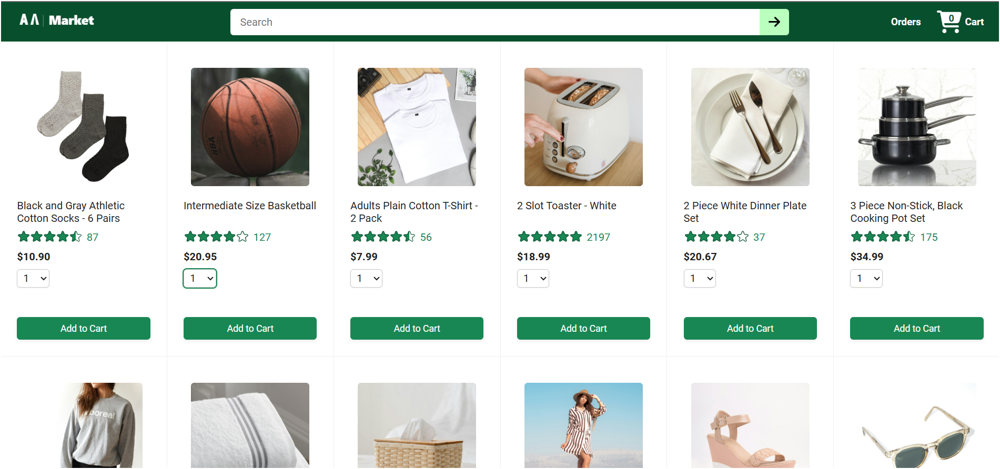
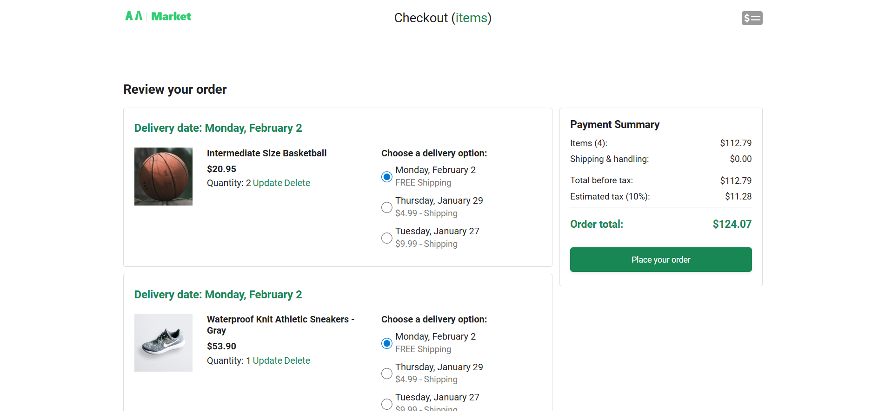
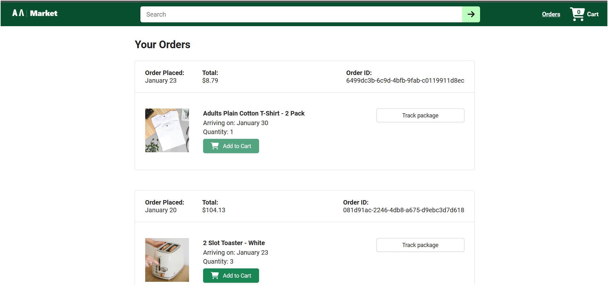
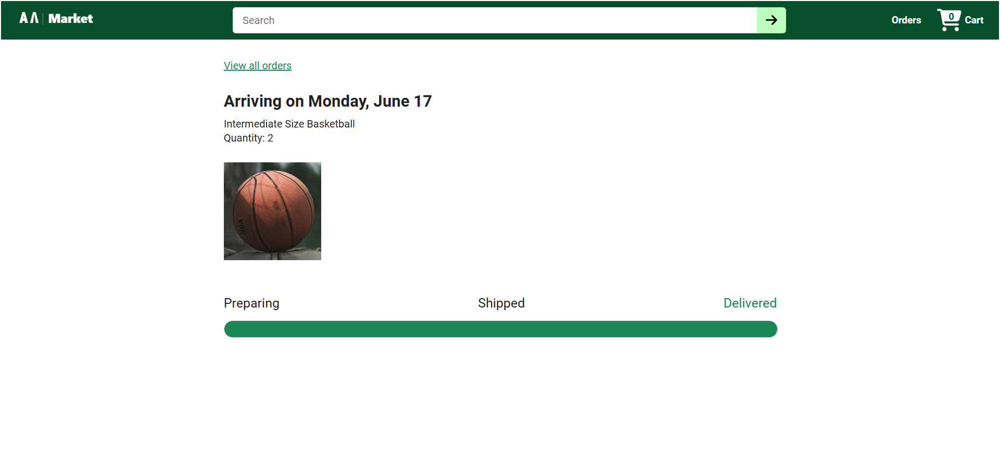

# React E-commerce Frontend

A React + TypeScript e-commerce frontend built with Vite.  
TypeScript migration is currently in progress.

---

## 🚀 Features

- Product listing with search
- Add to cart, update cart, remove items
- Checkout flow with delivery options
- Order summary & tracking
- Responsive UI
- Unit + integration tests using Vitest
- TypeScript migration ongoing

---

## 📸 Screenshots

### Home Page


### Checkout Page


### Order Page


### Tracking Page


---

## 🧱 Project Structure

src/
├── assets/
├── components/
├── pages/
├── utils/
├── tests/
└── App.tsx


⚠️ **Note:** Some files are still JavaScript and will be migrated to TypeScript.

---

## 🛠️ Tech Stack

- React
- Vite
- TypeScript (partial migration)
- Vitest
- React Router
- Axios
- ESLint

---

## 📦 Installation

```bash
git clone https://github.com/Akash-Jadon-7895/react-ecommerce-frontend.git
cd react-ecommerce-frontend
npm install
```

## 🧪 Run Tests

```bash
npm run test
```

## 🚀 Development Server

```bash
npm run dev
```

## 📌 Build

```bash
npm run build
```

## 🧾 Notes

- Backend and legacy JS project files were removed to keep the repository clean.
- TypeScript migration is still in progress. Some components/utilities may still use JavaScript.

## 📌 License

MIT License

## 👤 Author

Akash Jadon